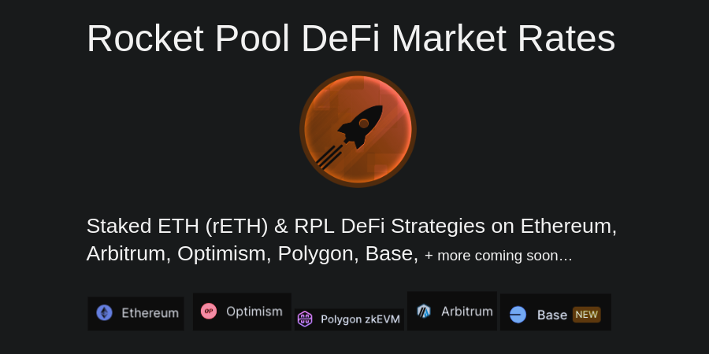

# rETH Opportunities

The Rocket Pool [Liquid Staking Token rETH](https://rocketpool.net/liquid-staking/what-is-liquid-staking) can be used in DeFi protocols to earn additional yield.

---

# [rpldefi.com](https://docs.google.com/document/d/1XiOPWMjG5_BBxF5G5MafZc9Cde24y9jp-iKWKZsJxpk)

An up-to-date summary of opportunities to use rETH across several platforms and protocols.

---
