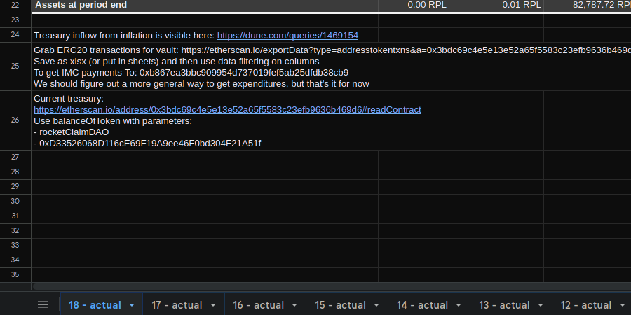
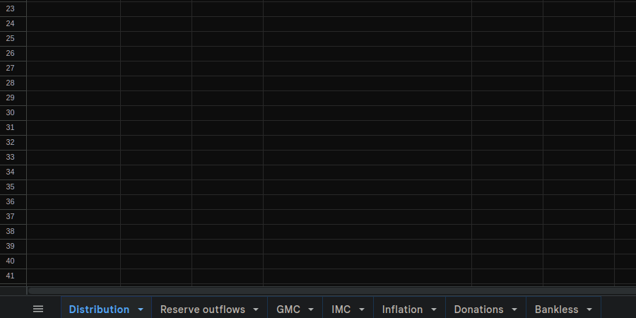

# pDAO 

Rocket Pool node operators comprise the [Protocol DAO.](https://rpips.rocketpool.net/RPIPs/RPIP-23)
 
---

# [Treasury Reports](https://docs.google.com/spreadsheets/d/1b8ZtXBzh2TkwrdyGYMPtjZNPB4jzErhp0z29rwb2ByQ/)

Periodic reports on the pDAO's inflows and outflows from its treasurer.

---

# [Treasury Summary](https://docs.google.com/spreadsheets/d/1Zo9iFJ2YZNAkgNo53yJGSCnz8XAYuLJ7SeiwJx6oF0A/)

A summary of the pDAO's treasury kept up-to-date by the pDAO treasurer.

---
