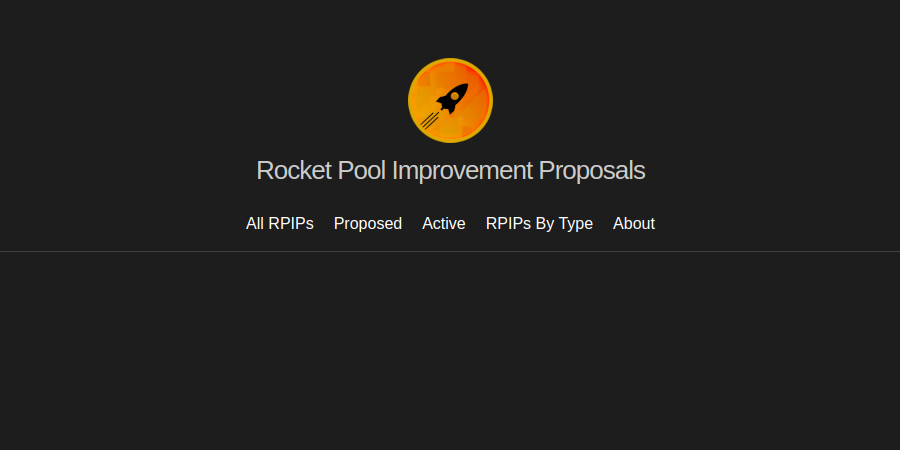

# RPIPs

RPIPs (Rocket Pool Improvement Proposals) are the formal documents used to propose changes to the protocol.

---

# [RPIP Dashboard](https://rpips.rocketpool.net/)

This dashboard shows RPIPs that have been put forth to the pDAO for discussion, voting and adoption.

---
