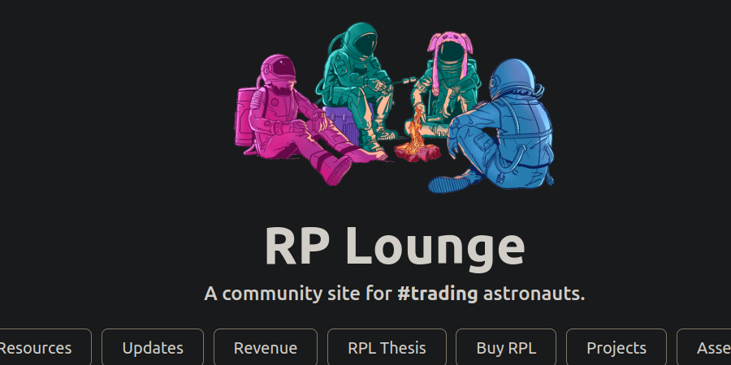

# Websites

Resources on the World Wide Web.

---

# [Rocket Pool](https://stake.rocketpool.net)

The official website where you can stake ETH for rETH, increase your node's RPL stake, migrate RPLv1 to RPLv2, or update your node's withdrawal address.

---

# [Rocket Pool Docs](https://docs.rocketpool.net/)

The official documentation, whether you need a detailed overview or staking guides. 

---

# [Rocket Pool Lounge](https://rocketpool.community)

This website acts as a community archive of memes, investment theses, and cat pix.

---

# [Rocket Pool Medium Articles](https://medium.com/rocket-pool)

The official Medium articles written by the Rocket Pool core team.

---

# [Rocket Pool University](https://rocketpooluniversity.xyz/)

A mysterious physics whiz created this interactive learning resource.

---
