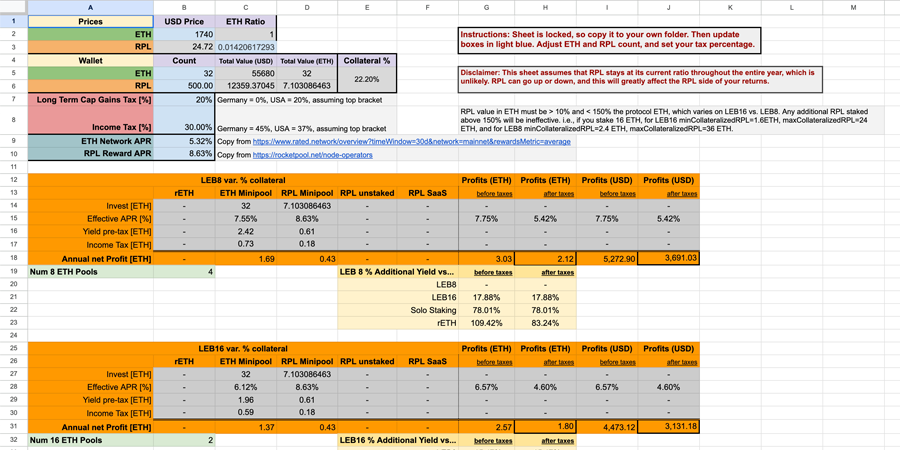
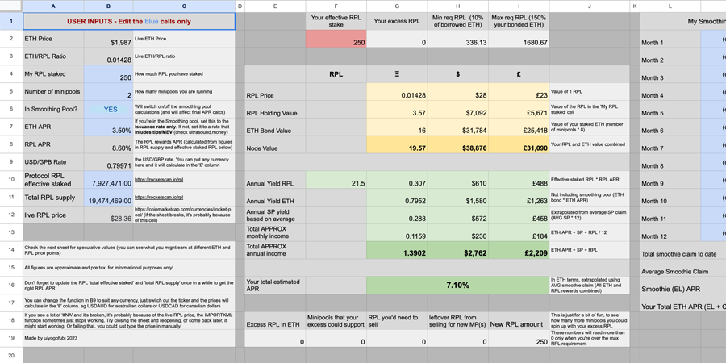

# Calculators

There have been several calculators built for the Rocket Pool community.

---

# [Cayos' Spreadsheet](https://docs.google.com/spreadsheets/d/1d4DuLa4KqAn9nS3J85m4Oou979ykgC8UQRcqJGbRHbk)

Community Member Cayos put this spreadsheet together, it compares the returns between solo staking, LEB16s and LEB8s.

---

# [yogofubi's Spreadsheet](https://docs.google.com/spreadsheets/d/1oVosZa5sTn2ldIHV2Kf9PfDNu6t0WohMwdx7nmaXk1s/edit#gid=0)

Community Member yogofubi built this spreadsheet to give a deeper breakdown of yield relative to ETH, USD and RPL.

---

