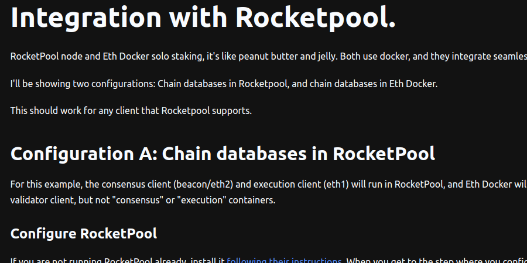
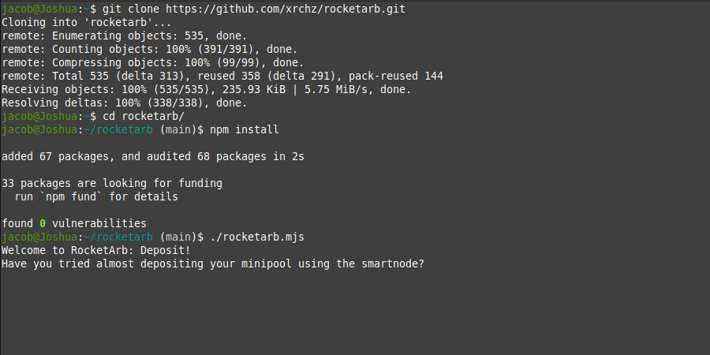
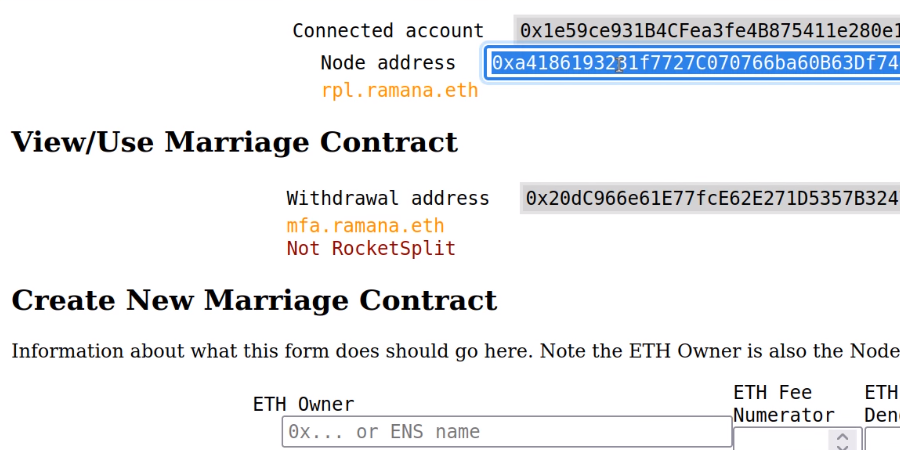
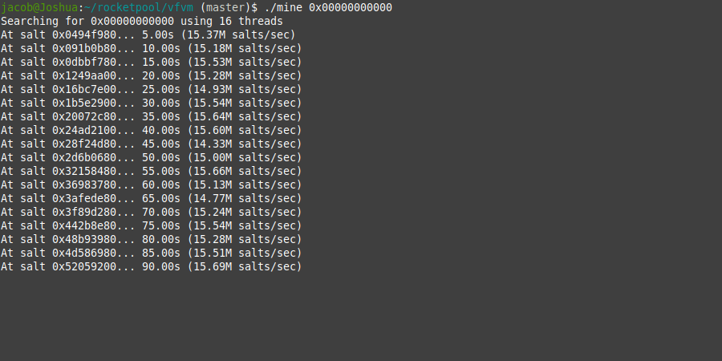

# Node Customization

---

# [eth-docker](https://eth-docker.net/Support/Rocketpool/)

Guides on how to use Smartnode in conjunction with eth-docker in order to run solo validators with an RP node or vice versa.

---

# [rocketarb](https://github.com/xrchz/rocketarb)

Community Member Ramana/xrchz built a tool to help Node Operators capture arbitrage profits when creating new Minipools.
It only works when there's a secondary market premium on rETH, the deposit pool is full, and the rETH contract has no liquidity.

---

# [rocketsplit](https://rocketsplit.xyz)

Community Member Ramana/xrchz built a tool to deploy custom splitter Smart Contracts to facilitate Nodes with distinct RPL / ETH providers.
 
---

# [vfvm](https://github.com/jshufro/rocketpool-vfvm)

Community Member Patches built a Very Fast Vanity Miner for quickly mining minipool vanity addresses.

---
