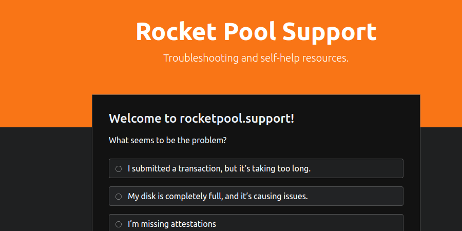
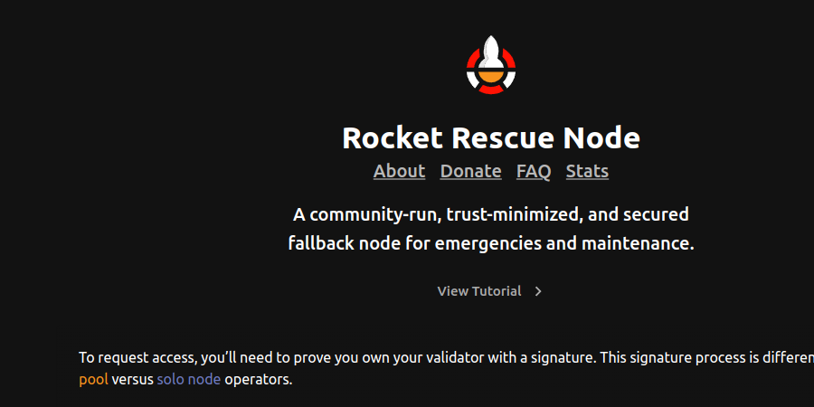

# Support Resources for Node Operators

[#support on Discord](https://discord.gg/rocketpool), is the best place to ask questions, but first here are some useful resources.

---

# [rocketpool.support](https://rocketpool.support)

Community Member hanniabu built a website to help Node Operators solve issues with their node(s). 

---

# [Rocket Rescue Node](https://rescuenode.com)

Built and maintained by several community members, Rescue Node is a trust-minimized, secured fallback for emergencies and maintenance.

---
